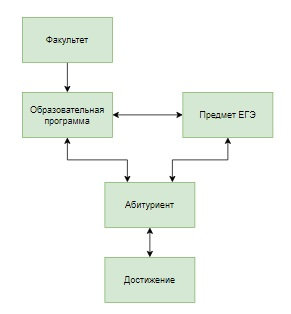
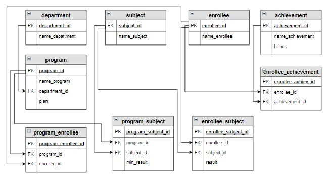

# База данных «Абитуриент», запросы на выборку

**Предметная область**

Университет состоит из совокупности факультетов (школ). Поступление абитуриентов осуществляется на образовательные программы по результатам Единого государственного экзамена (ЕГЭ). Каждая образовательная программа относится к определенному факультету, для нее определены необходимые для поступления предметы ЕГЭ, минимальный балл по этим предметам, а также план набора (количество мест) на образовательную программу.

В приемную комиссию абитуриенты подают заявления на образовательную программу, каждый абитуриент может выбрать несколько образовательных программ (но не более трех). В заявлении указывается фамилия, имя, отчество абитуриента, а также его достижения: получил ли он медаль за обучение в школе, имеет ли значок ГТО и пр. При этом за каждое достижение определен дополнительный балл. Абитуриент предоставляет сертификат с результатами сдачи  ЕГЭ. Если абитуриент выбирает образовательную программу, то у него обязательно должны быть сданы предметы, определенные на эту программу, причем балл должен быть не меньше минимального по данному предмету.

Зачисление абитуриентов осуществляется так: сначала вычисляется сумма баллов по предметам на каждую образовательную программу, добавляются баллы достижения, затем абитуриенты сортируются в порядке убывания суммы баллов и отбираются первые по количеству мест, определенному планом набора.

Запросы для предметной области:
- Вывести абитуриентов, которые хотят поступать на определенную образовательную программу.
- Вывести образовательные программы, на которые для поступления необходим определенный предмет ЕГЭ.
- Вывести статистическую информацию по каждому предмету  ЕГЭ.
- Вывести образовательные программы, минимальные баллы по каждому предмету которых, превышают заданное значение.
- Вывести образовательные программы. которые имеют самый большой план набора.
- Посчитать, сколько дополнительных баллов получит каждый абитуриент.
- Посчитать конкурс на каждую образовательную программу.
- Вывести образовательные программы, на которые для поступления необходимы два определенных предмета ЕГЭ.
- Посчитать количество баллов каждого абитуриента на каждую образовательную программу по результатам ЕГЭ.
- Вывести абитуриентов, которые не могут быть зачислены на образовательную программу.

**Концептуальная схема базы данных**

**Логическая схема базы данных**

**Структура и наполнение таблиц**

Таблица `department`:

| **department_id**                | **name_department**     |
|:---------------------------------|:------------------------|
| `INT PRIMARY KEY AUTO_INCREMENT` | `VARCHAR(30)`           |
| 1                                | Инженерная школа        |
| 2                                | Школа естественных наук |

Таблица `subject`:

| **subject_id**                   | **name_subject** |
|:---------------------------------|:-----------------|
| `INT PRIMARY KEY AUTO_INCREMENT` | `VARCHAR(30)`    |
| 1                                | Русский язык     |
| 2                                | Математика       |
| 3                                | Физика           |
| 4                                | Информатика      |

Таблица `program` (в последнем столбце указан план набора абитуриентов на образовательную программу):

| **program_id**                   | **name_program**                    | **department_id** | **plan** |  
|:---------------------------------|:------------------------------------|:------------------|:---------|  
| `INT PRIMARY KEY AUTO_INCREMENT` | `VARCHAR(50)`                       | `INT`             | `INT`    |  
| 1                                | Прикладная математика и информатика | 2                 | 2        |  
| 2                                | Математика и компьютерные науки     | 2                 | 1        |  
| 3                                | Прикладная механика                 | 1                 | 2        |  
| 4                                | Мехатроника и робототехника         | 1                 | 3        |  

Таблица `enrollee`:

| **enrollee_id**                  | **name_enrollee** |
|:---------------------------------|:------------------|
| `INT PRIMARY KEY AUTO_INCREMENT` | `VARCHAR(50)`     |
| 1                                | Баранов Павел     |
| 2                                | Абрамова Катя     |
| 3                                | Семенов Иван      |
| 4                                | Яковлева Галина   |
| 5                                | Попов Илья        |
| 6                                | Степанова Дарья   |

Таблица `achievement` (таблица включает все достижения, которые учитываются при поступлении в университет, в последнем столбце указывается количество баллов, которое добавляется к сумме баллов по предметам ЕГЭ при расчете общего балла абитуриента):

| **achievement_id**               | **name_achievement**  | **bonus** | 
|:---------------------------------|:----------------------|:----------|  
| `INT PRIMARY KEY AUTO_INCREMENT` | `VARCHAR(30)`         | `INT`     |  
| 1                                | Золотая медаль        | 5         |
| 2                                | Серебряная медаль     | 3         |
| 3                                | Золотой значок ГТО    | 3         |
| 4                                | Серебряный значок ГТО | 1         |

Таблица `enrollee_achievement` (в таблице содержится информация о том, какие достижения имеют абитуриенты):

| **enrollee_achiev_id**           | **enrollee_id** | **achievement_id** | 
|:---------------------------------|:----------------|:-------------------|  
| `INT PRIMARY KEY AUTO_INCREMENT` | `INT`           | `INT`              |  
| 1                                | 1               | 2                  |
| 2                                | 1               | 3                  |
| 3                                | 3               | 1                  |
| 4                                | 4               | 4                  |
| 5                                | 5               | 1                  |
| 6                                | 5               | 3                  |

Таблица `program_subject` (в таблице указано, какие предметы ЕГЭ необходимы для поступления на каждую программу, в последнем столбце – минимальный балл по каждому предмету для образовательной программы):

| **program_subject_id**           | **program_id** | **subject_id** | **min_result** | 
|:---------------------------------|:---------------|:---------------|:---------------|  
| `INT PRIMARY KEY AUTO_INCREMENT` | `INT`          | `INT`          | `INT`          |  
| 1                                | 1              | 1              | 40             |
| 2                                | 1              | 2              | 50             |
| 3                                | 1              | 4              | 60             |
| 4                                | 2              | 1              | 30             |
| 5                                | 2              | 2              | 50             |
| 6                                | 2              | 4              | 60             |
| 7                                | 3              | 1              | 30             |
| 8                                | 3              | 2              | 45             |
| 9                                | 3              | 3              | 45             |
| 10                               | 4              | 1              | 40             |
| 11                               | 4              | 2              | 45             |
| 12                               | 4              | 3              | 45             |

Таблица `program_enrollee` (таблица включает информацию, на какую образовательную программу хочет поступить абитуриент):

| **program_enrollee_id**          | **program_id** | **enrollee_id** | 
|:---------------------------------|:---------------|:----------------|  
| `INT PRIMARY KEY AUTO_INCREMENT` | `INT`          | `INT`           |  
| 1                                | 3              | 1               |
| 2                                | 4              | 1               |
| 3                                | 1              | 1               |
| 4                                | 2              | 2               |
| 5                                | 1              | 2               |
| 6                                | 1              | 3               |
| 7                                | 2              | 3               |
| 8                                | 4              | 3               |
| 9                                | 3              | 4               |
| 10                               | 3              | 5               |
| 11                               | 4              | 5               |
| 12                               | 2              | 6               |
| 13                               | 3              | 6               |
| 14                               | 4              | 6               |

Таблица `enrollee_subject` (баллы ЕГЭ каждого абитуриента):

| **enrollee_subject_id** | **enrollee_id** | **subject_id** | **result** | 
|:------------------------|:----------------|:---------------|:-----------|  
| `I`                     | `INT`           | `INT`          | `INT`      |  
| 1                       | 1               | 1              | 68         |
| 2                       | 1               | 2              | 70         |
| 3                       | 1               | 3              | 41         |
| 4                       | 1               | 4              | 75         |
| 5                       | 2               | 1              | 75         |
| 6                       | 2               | 2              | 70         |
| 7                       | 2               | 4              | 81         |
| 8                       | 3               | 1              | 85         |
| 9                       | 3               | 2              | 67         |
| 10                      | 3               | 3              | 90         |
| 11                      | 3               | 4              | 78         |
| 12                      | 4               | 1              | 82         |
| 13                      | 4               | 2              | 86         |
| 14                      | 4               | 3              | 70         |
| 15                      | 5               | 1              | 65         |
| 16                      | 5               | 2              | 67         |
| 17                      | 5               | 3              | 60         |
| 18                      | 6               | 1              | 90         |
| 19                      | 6               | 2              | 92         |
| 20                      | 6               | 3              | 88         |
| 21                      | 6               | 4              | 94         |

**Пояснение.** Для всех внешних ключей в базе данных установлено `ON DELETE CASCADE`.
