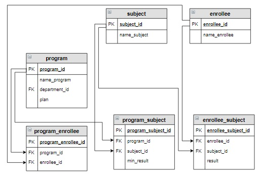

# Задание

**Задание**

Создать вспомогательную таблицу `applicant`, куда включить `id` образовательной программы, `id` абитуриента, сумму баллов абитуриентов (столбец `itog`) в отсортированном сначала по `id` образовательной программы, а потом по убыванию суммы баллов виде (использовать запрос из предыдущего урока).

**Фрагмент логической схемы базы данных:**

<p float="left">

</p>

Введите SQL запрос

*Результат:*

```mysql
Affected rows: 14
```

```mysql
CREATE TABLE applicant
SELECT program_id, enrollee.enrollee_id, SUM(result) AS itog
FROM program
     INNER JOIN program_enrollee USING(program_id)
     INNER JOIN program_subject USING(program_id)
     INNER JOIN enrollee USING(enrollee_id)
     INNER JOIN subject ON subject.subject_id = program_subject.subject_id
     INNER JOIN enrollee_subject ON enrollee_subject.enrollee_id = enrollee.enrollee_id AND 
                                    enrollee_subject.subject_id = program_subject.subject_id
GROUP BY program_id, enrollee.enrollee_id 
ORDER BY program_id, itog DESC;
```

Вы получили: 1 балл из 1
