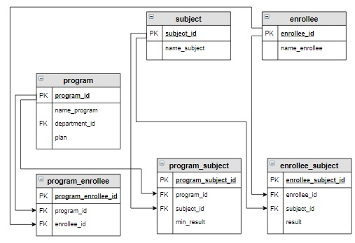

# Задание

**Задание**

Из таблицы `applicant`, созданной на предыдущем шаге, удалить записи, если абитуриент на выбранную образовательную программу не набрал минимального балла хотя бы по одному предмету (использовать запрос из предыдущего урока).

**Фрагмент логической схемы базы данных:**

<p float="left">

</p>

Таблица `applicant`:

<p float="left">

</p>

Введите SQL запрос

*Результат:*

```mysql
Affected rows: 2
```

```mysql
DELETE FROM applicant
USING applicant
      INNER JOIN program_subject USING(program_id)
      INNER JOIN enrollee_subject USING(enrollee_id, subject_id)
WHERE result < min_result;
```

Вы получили: 1 балл из 1
