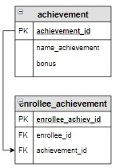
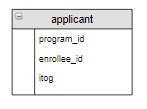

# Задание

**Задание**

Повысить итоговые баллы абитуриентов в таблице `applicant` на значения дополнительных баллов (использовать запрос из предыдущего урока).

**Фрагмент логической схемы базы данных:**

<p float="left">

</p>

**Структура корректируемой таблицы:**

<p float="left">

</p>

Введите SQL запрос

*Результат:*

```mysql
Affected rows: 7
```

```mysql
UPDATE applicant INNER JOIN (SELECT enrollee_id, IF(SUM(bonus) IS NULL, 0, SUM(bonus)) AS sum_bonus
                             FROM achievement INNER JOIN enrollee_achievement USING(achievement_id)
                             GROUP BY enrollee_id) AS bon_tap ON applicant.enrollee_id = bon_tap.enrollee_id
SET itog = itog + sum_bonus;
```

Вы получили: 1 балл из 1
