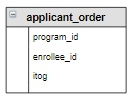

# Задание

Рассмотрим, как происходит формирование списка абитуриентов, проходящих по конкурсу на образовательные программы. 

В таблицу `applicant_order` для пояснения включены столбцы «План набора» и «Результат». Каждая программа имеет свой план набора, например, план набора образовательной программы с `id` 1 – 2 человека. Проходящими по конкурсу считаются первые два человека в списке  отсортированных по итоговому баллу абитуриентов, подавших заявление на  образовательную программу. Это абитуриенты с `id` 3 и 2. Аналогично отбираются абитуриенты на остальные образовательные программы. В таблице все проходящие по конкурсу выделены зеленым цветом.

| **program_id** | **план набора** | **enrollee_id** | **itog** | **Результат**             |
|:---------------|:----------------|:----------------|:---------|:--------------------------|
| 1              | 2               | 3               | 235      | рекомендован к зачислению |
| 1              | 2               | 2               | 226      | рекомендован к зачислению |
| 1              | 2               | 1               | 219      |                           |
| 2              | 1               | 6               | 276      | рекомендован к зачислению |
| 2              | 1               | 3               | 235      |                           |
| 2              | 1               | 2               | 226      |                           |
| 3              | 2               | 6               | 270      | рекомендован к зачислению |
| 3              | 2               | 4               | 239      | рекомендован к зачислению |
| 3              | 2               | 5               | 200      |                           |
| 4              | 3               | 6               | 270      | рекомендован к зачислению |
| 4              | 3               | 3               | 247      | рекомендован к зачислению |
| 4              | 3               | 5               | 200      | рекомендован к зачислению |

Для отбора рекомендованных к зачислению студентов можно разработать различные алгоритмы. Мы реализуем несколько SQL запросов. В первом запросе вставим в таблицу `applicant_order` новый столбец для последовательной нумерации строк. 

Для изменения структуры таблицы используется оператор `ALTER TABLE`. С его помощью можно вставить новый столбец, удалить существующий, переименовать столбец и пр.

Для вставки нового столбца используется SQL запросы:

```mysql
ALTER TABLE таблица ADD имя_столбца тип; - вставляет столбец после последнего
ALTER TABLE таблица ADD имя_столбца тип FIRST; - вставляет столбец перед первым
ALTER TABLE таблица ADD имя_столбца тип AFTER имя_столбца_1; - вставляет столбец после укзанного столбца
```

Для удаления столбца используется SQL запросы:

```mysql
ALTER TABLE таблица DROP COLUMN имя_столбца; - удаляет столбец с заданным именем
ALTER TABLE таблица DROP имя_столбца; - ключевое слово COLUMN не обязательно указывать
ALTER TABLE таблица DROP имя_столбца,
                    DROP имя_столбца_1; - удаляет два столбца
```

Для переименования столбца используется  запрос (тип данных указывать обязательно):

```mysql
ALTER TABLE таблица CHANGE имя_столбца новое_имя_столбца ТИП ДАННЫХ;
```

Для изменения типа  столбца используется запрос (два раза указывать имя столбца обязательно):

```mysql
ALTER TABLE таблица CHANGE имя_столбца имя_столбца НОВЫЙ_ТИП_ДАННЫХ;
```

**Задание**

Включить в таблицу `applicant_order` новый столбец `str_id` целого типа, расположить его перед первым.

**Структура корректируемой таблицы:**

<p float="left">

</p>

Введите SQL запрос

*Результат:*

```mysql
Affected rows: 0
```

```mysql
ALTER TABLE applicant_order ADD str_id INT FIRST;
```

Вы получили: 1 балл из 1
