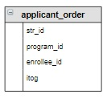

# Нумерация строк

Номер строки в таблице или запросе в некоторых версиях SQL можно получить с помощью оконной функции `row_number()`.  Когда создавался этот шаг версии SQL на платформе Stepik эта функция не поддерживалась. Сейчас версию изменили, оконные функции рассматриваются в следующем уроке.

На этом шаге нумерацию реализуем с помощью переменных.  Переменные задаются с помощью ключевого слова `SET`, перед именем указывается символ @. Например, создадим переменную `@row_num` и присвоим ей значение 1:

```mysql
SET @row_num := 1;
```

Теперь эту переменную можно использовать в запросах, кроме того в запросах можно изменить ее значение.

**Пример**

Пронумеруем записи в таблице `applicant_order`.

*Запрос:*

```mysql
SET @row_num := 0;

SELECT *, (@row_num := @row_num + 1) AS str_num
FROM  applicant_order;
```

*Результат:*

```mysql
+------------+-------------+------+---------+
| program_id | enrollee_id | itog | str_num |
+------------+-------------+------+---------+
| 1          | 3           | 235  | 1       |
| 1          | 2           | 226  | 2       |
| 1          | 1           | 219  | 3       |
| 2          | 6           | 276  | 4       |
| 2          | 3           | 235  | 5       |
| 2          | 2           | 226  | 6       |
| 3          | 6           | 270  | 7       |
| 3          | 4           | 239  | 8       |
| 3          | 5           | 200  | 9       |
| 4          | 6           | 270  | 10      |
| 4          | 3           | 247  | 11      |
| 4          | 5           | 200  | 12      |
+------------+-------------+------+---------+
```

**Пример**

Создадим нумерацию, которая начинается заново для каждой образовательной программы. Для этого можно использовать алгоритм, в котором в переменную `@row_num` заносится 1, если `id` программы в предыдущей записи не равен `id` программы в текущей:
- объявить переменную `@num_pr`, задать ей начальное значение;
- запомнить `id` образовательной программы для текущей записи в переменной `@num_pr`;
- для следующей записи сравнить значение переменной `@num_pr` с `id` образовательной программы;
- если они равны, то продолжить нумерацию `@row_num := @row_num + 1`;
- в противном случае начать нумерацию снова, для этого установить `@row_num := 1`.

*Запрос:*

```mysql
SET @num_pr := 0;
SET @row_num := 1;

SELECT *, 
     if(program_id = @num_pr, @row_num := @row_num + 1, @row_num := 1) AS str_num,
     @num_pr := program_id AS add_var 
from applicant_order;
```

*Результат:*

```mysql
+------------+-------------+------+---------+---------+
| program_id | enrollee_id | itog | str_num | add_var |
+------------+-------------+------+---------+---------+
| 1          | 3           | 235  | 1       | 1       |
| 1          | 2           | 226  | 2       | 1       |
| 1          | 1           | 219  | 3       | 1       |
| 2          | 6           | 276  | 1       | 2       |
| 2          | 3           | 235  | 2       | 2       |
| 2          | 2           | 226  | 3       | 2       |
| 3          | 6           | 270  | 1       | 3       |
| 3          | 4           | 239  | 2       | 3       |
| 3          | 5           | 200  | 3       | 3       |
| 4          | 6           | 270  | 1       | 4       |
| 4          | 3           | 247  | 2       | 4       |
| 4          | 5           | 200  | 3       | 4       |
+------------+-------------+------+---------+---------+
```

**Задание**

Занести в столбец `str_id` таблицы `applicant_order` нумерацию абитуриентов, которая начинается с 1 для каждой образовательной программы.

**Структура корректируемой таблицы:**

<p float="left">

</p>

Введите SQL запрос

*Результат:*

```mysql
Affected rows: 0

Affected rows: 0

Affected rows: 12
```

```mysql
SET @num_enr := 1;
SET @num_prog := 0;

UPDATE applicant_order
SET str_id = IF(program_id = @num_prog, @num_enr := @num_enr + 1, @num_enr := 1 AND @num_prog := program_id);
```

Вы получили: 1 балл из 1
