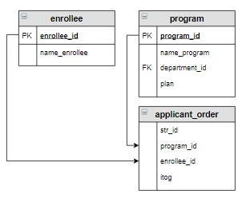

# Задание

**Задание**

Создать таблицу `student`, в которую включить абитуриентов, которые могут быть рекомендованы к зачислению  в соответствии с планом набора. Информацию отсортировать сначала в алфавитном порядке по названию программ, а потом по убыванию итогового балла.

**Фрагмент логической схемы базы данных:**

<p float="left">

</p>

Введите SQL запрос

*Результат:*

```mysql
Affected rows: 8
```

```mysql
CREATE TABLE student
SELECT name_program, name_enrollee, itog
FROM applicant_order
     INNER JOIN program USING(program_id)
     INNER JOIN enrollee USING(enrollee_id)
WHERE str_id <= plan
ORDER BY name_program, itog DESC;
```

Вы получили: 1 балл из 1
