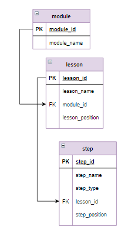

# Задание

Платформа Stepik представляет довольно скудную навигацию по шагам модуля. Очень трудно вспомнить, на каком шаге изучался тот или иной материал. База данных этого урока позволяет с помощью запросов реализовать удобный поиск нужных шагов.

**Задание**

Отобрать все шаги, в которых рассматриваются вложенные запросы (то есть в названии шага упоминаются вложенные запросы). Указать к какому уроку и модулю они относятся. Для этого вывести 3 поля:
- в поле `Модуль` указать номер модуля и его название через пробел;
- в поле `Урок` указать номер модуля, порядковый номер урока (`lesson_position`) через точку и название урока через пробел;
- в поле `Шаг` указать номер модуля, порядковый номер урока (`lesson_position`) через точку, порядковый номер шага (`step_position`) через точку и название шага через пробел.

Длину полей `Модуль` и `Урок` ограничить 19 символами, при этом слишком длинные надписи обозначить многоточием в конце (16 символов - это номер модуля или урока, пробел и название `Урока` или `Модуля` к ним присоединить `"..."`). Информацию отсортировать по возрастанию номеров модулей, порядковых номеров уроков и порядковых номеров шагов.

**Фрагмент логической схемы базы данных:**

<p float="left">

</p>

Введите SQL запрос

*Результат:*

```mysql
Query result:
+---------------------+---------------------+-------------------------------------------------------------+
| Модуль              | Урок                | Шаг                                                         |
+---------------------+---------------------+-------------------------------------------------------------+
| 1 Основы реляцио... | 1.4 Вложенные за... | 1.4.2 Вложенный запрос, возвращающий одно значение          |
| 1 Основы реляцио... | 1.4 Вложенные за... | 1.4.3 Использование вложенного запроса в выражении          |
| 1 Основы реляцио... | 1.4 Вложенные за... | 1.4.4 Вложенный запрос, оператор IN                         |
| 1 Основы реляцио... | 1.4 Вложенные за... | 1.4.5 Вложенный запрос, операторы ANY и ALL                 |
| 1 Основы реляцио... | 1.4 Вложенные за... | 1.4.6 Вложенный запрос после SELECT                         |
| 1 Основы реляцио... | 1.5 Запросы корр... | 1.5.5 Добавление записей, вложенные запросы                 |
| 2 Запросы SQL к ... | 2.2 Запросы на в... | 2.2.7 Запросы для нескольких таблиц со вложенными запросами |
| 2 Запросы SQL к ... | 2.2 Запросы на в... | 2.2.8 Вложенные запросы в операторах соединения             |
| 2 Запросы SQL к ... | 2.3 Запросы корр... | 2.3.5 Запрос на обновление, вложенные запросы               |
+---------------------+---------------------+-------------------------------------------------------------+
Affected rows: 9
```

```mysql
SELECT IF(LENGTH(CONCAT_WS(' ', module_id, module_name)) > 19,
          CONCAT(LEFT(CONCAT_WS(' ', module_id, module_name), 16), '...'),
          CONCAT_WS(' ', module_id, module_name)) AS Модуль,
       IF(LENGTH(CONCAT_WS(' ',CONCAT_WS('.', module_id, lesson_position), lesson_name)) > 19,
          CONCAT(LEFT(CONCAT_WS(' ',CONCAT_WS('.', module_id, lesson_position), lesson_name), 16), '...'),
          CONCAT_WS(' ',CONCAT_WS('.', lesson_id, lesson_position), lesson_name)) AS Урок,
       CONCAT_WS(' ',CONCAT_WS('.', module_id, lesson_position, step_position), step_name) AS Шаг
FROM lesson
     INNER JOIN module USING(module_id)
     INNER JOIN step USING(lesson_id)
WHERE step_name LIKE "%вложенн%" AND step_name LIKE "%запрос%"
ORDER BY Модуль, Урок, Шаг;
```

Вы получили: 2 балл из 2
