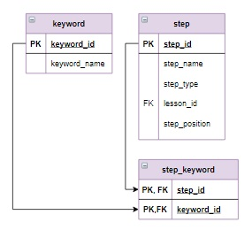

# Задание

Еще одна возможность улучшить навигацию по курсу - это реализация поиска шагов по ключевым словам. Для этого необходимо создать таблицу с терминами `keyword`, а затем связать ее с таблицей `step` через вспомогательную таблицу `step_keyword`. Каждая запись этой таблицы - это `id` шага и `id` встречающегося на этом шаге ключевого слова.

**Задание**

Заполнить таблицу `step_keyword` следующим образом: если ключевое слово есть в названии шага, то включить в `step_keyword` строку с `id` шага и `id` ключевого слова.

**Фрагмент логической схемы базы данных:**

<p float="left">

</p>

Введите SQL запрос

*Результат:*

```mysql
Affected rows: 27
```

```mysql
INSERT INTO step_keyword (step_id, keyword_id)
SELECT step_id, keyword_id
FROM keyword CROSS JOIN step
WHERE REGEXP_INSTR(step_name, CONCAT('\\b', keyword_name, '\\b')) > 0
ORDER BY keyword_id;
```

Вы получили: 2 балл из 2
