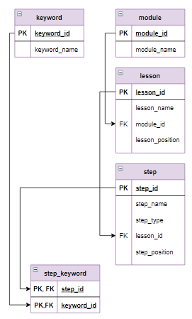

# Задание

**Задание**

Реализовать поиск по ключевым словам. Вывести шаги, с которыми связаны ключевые слова `MAX` и `AVG` одновременно. Для шагов указать `id` модуля, позицию урока в модуле, позицию шага в уроке через точку, после позиции шага перед заголовком - пробел. Позицию шага в уроке вывести в виде двух цифр (если позиция шага меньше 10, то перед цифрой поставить 0). Столбец назвать `Шаг`. Информацию отсортировать по первому столбцу в алфавитном порядке.

**Фрагмент логической схемы базы данных:**

<p float="left">

</p>

Введите SQL запрос

*Результат:*

```mysql
Query result:
+---------------------------------------------------------+
| Шаг                                                     |
+---------------------------------------------------------+
| 1.3.04 Выборка данных, групповые функции MIN, MAX и AVG |
| 1.4.06 Вложенный запрос после SELECT                    |
+---------------------------------------------------------+
Affected rows: 2
```

```mysql
SELECT CONCAT(module_id,'.',lesson_position,IF(step_position < 10, ".0","."),step_position,' ',step_name) AS Шаг
FROM module
     INNER JOIN lesson USING(module_id)
     INNER JOIN step USING(lesson_id)
     INNER JOIN step_keyword USING(step_id)
     INNER JOIN keyword USING(keyword_id)
WHERE keyword_name='MAX' OR 'AVG'
ORDER BY 1;
```

Вы получили: 2 балл из 2
