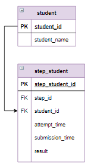

# Выборка данных по нескольким условиям, оператор CASE

С помощью оператора `CASE` можно в зависимости от нескольких условий получить один из нескольких результатов.

Оператор `CASE` записывается в виде:

```mysql
CASE  
     WHEN логическое_выражение_1 THEN выражение_1
     WHEN логическое_выражение_2 THEN выражение_2
     ...
     ELSE выражение_else   
END
```

Раздел `ELSE` является необязательным.

Выполняется оператор `CASE` так:
- вычисляется `логическое_выражение_1`, если оно истинно, то результатом оператора является `выражение_1`, если ложно - выполнение оператора продолжается;
- вычисляется `логическое_выражение_2`, если оно истинно, то результатом оператора является `выражение_2`, если ложно - выполнение оператора продолжается;
- если все логические выражения оказались ложными, то результат оператора - `выражение_else`

`CASE` можно использовать в `SELECT, UPDATE, DELETE, SET, WHERE, ORDER BY, HAVING` - всюду, где можно использовать выражения.

**Пример**

Отнести каждого студента к группе, в зависимости от пройденных заданий:

| **Интервал** | **Группа** |
|:-------------|:-----------|
| от 0 до 10   | I          |
| от 11 до 15  | II         |
| от 16 до 27  | III        |
| больше 27    | IV         |

Пройденными считаются задания с хотя бы одним верным ответом. В таблице `step_student` сохраняются все попытки пользователей, следовательно, могут быть пользователи, у которых на одно задание есть несколько верных попыток.

**Фрагмент логической схемы базы данных:**

<p float="left">

</p>

**Шаг 1.** Выведем всех студентов и все шаги, которые они прошли с результатом "correct". Этот шаг обязателен, чтобы не учитывать  правильные решения несколько раз.

*Запрос:*

```mysql
SELECT student_name, step_id
FROM 
    student 
    INNER JOIN step_student USING(student_id)
WHERE result = "correct"
GROUP BY student_name, step_id;
```

*Результат:*

```mysql
Query result:
+--------------+---------+
| student_name | step_id |
+--------------+---------+
| student_52   | 10      |
| student_11   | 10      |
| student_19   | 10      |
| student_4    | 10      |
| student_5    | 10      |
| student_53   | 10      |
| student_39   | 10      |
| student_32   | 10      |
| student_61   | 10      |
| student_43   | 10      |
| student_13   | 10      |
| student_57   | 10      |
             ...
+--------------+---------+

Affected rows: 1126.
```

**Шаг 2.** Посчитаем, сколько шагов прошел каждый студент.

*Запрос:*

```mysql
SELECT student_name, count(*) as rate
FROM 
    (
     SELECT student_name, step_id
     FROM 
         student 
         INNER JOIN step_student USING(student_id)
     WHERE result = "correct"
     GROUP BY student_name, step_id
    ) query_in
GROUP BY student_name
ORDER BY 2;
```

*Результат:*

```mysql
+--------------+------+
| student_name | rate |
+--------------+------+
| student_29   | 8    |
| student_47   | 8    |
| student_16   | 9    |
| student_5    | 9    |
| student_63   | 9    |
| student_33   | 10   |
| student_17   | 10   |
| student_64   | 10   |
            ...
+--------------+------+
Affected rows: 64
```

**Шаг 3.** Отнести каждого студента к группе в зависимости от пройденных шагов.

*Запрос:*

```mysql
SELECT student_name, rate, 
    CASE
        WHEN rate <= 10 THEN "I"
        WHEN rate <= 15 THEN "II"
        WHEN rate <= 27 THEN "III"
        ELSE "IV"
    END AS Группа
FROM      
    (
     SELECT student_name, count(*) as rate
     FROM 
         (
          SELECT student_name, step_id
          FROM 
              student 
              INNER JOIN step_student USING(student_id)
          WHERE result = "correct"
          GROUP BY student_name, step_id
         ) query_in
     GROUP BY student_name 
     ORDER BY 2
    ) query_in_1;
```

*Результат:*

```mysql
Query result:
+--------------+------+--------+
| student_name | rate | Группа |
+--------------+------+--------+
| student_29   | 8    | I      |
| student_47   | 8    | I      |
| student_16   | 9    | I      |
| student_5    | 9    | I      |
| student_63   | 9    | I      |
| student_33   | 10   | I      |
| student_17   | 10   | I      |
| student_64   | 10   | I      |
| student_58   | 10   | I      |
| student_38   | 10   | I      |
| student_12   | 11   | II     |
| student_10   | 11   | II     |
              ...
+--------------+------+--------+
Affected rows: 64
```

**Задание**

Посчитать, сколько студентов относится к каждой группе. Столбцы назвать `Группа`, `Интервал`, `Количество`. Указать границы интервала.

Введите SQL запрос

*Результат:*

```mysql
Query result:
+--------+-------------+------------+
| Группа | Интервал    | Количество |
+--------+-------------+------------+
| I      | от 0 до 10  | 10         |
| II     | от 11 до 15 | 27         |
| III    | от 16 до 27 | 9          |
| IV     | больше 27   | 18         |
+--------+-------------+------------+
Affected rows: 4
```

```mysql
SELECT Группа, CASE
                   WHEN Группа = "I" THEN "от 0 до 10"
                   WHEN Группа = "II" THEN "от 11 до 15"
                   WHEN Группа = "III" THEN "от 16 до 27"
                   ELSE "больше 27"
               END AS Интервал,
               count(*) AS Количество
FROM (SELECT student_name, rate,         
    CASE
        WHEN rate <= 10 THEN "I"
        WHEN rate <= 15 THEN "II"
        WHEN rate <= 27 THEN "III"
        ELSE "IV"
    END AS Группа
FROM (SELECT student_name, count(*) as rate
      FROM (SELECT student_name, step_id
            FROM student INNER JOIN step_student USING(student_id)
            WHERE result = "correct"
            GROUP BY student_name, step_id) query_in
      GROUP BY student_name 
      ORDER BY 2) query_in_1) query_in_2
GROUP BY Группа
ORDER BY 1;
```

Вы получили: 2 балл из 2
