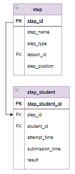

# Табличные выражения, оператор WITH

Табличное выражение определяется с помощью оператора `WITH` и является частью запроса. Его синтаксис:

```mysql
WITH имя_выражения (имя_1, имя_2,...)
  AS
    (
     SELECT столбец_1, столбец_2,
     FROM 
       ... 
     )
SELECT ...
   FROM имя_выражения
   ...
```

В табличном выражении определяется запрос, результат которого нужно использовать в основной части запроса после `SELECT`. При этом основной запрос может обратиться к столбцам результата табличного выражения через имена, заданные в заголовке `WITH`. При этом количество имен должно совпадать с количеством результирующих столбцов табличного выражения.

В одном запросе может быть несколько табличных выражений. При этом в каждом табличном выражении можно использовать все предшествующие ему табличные выражения.

В табличном выражении необязательно давать имена столбцам результата. В этом случае в основном запросе можно использовать имена столбцов, указанных после `SELECT` в табличном выражении. При наличии одинаковых имен в нескольких табличных выражениях необходимо использовать полное имя столбца (имя табличного выражения, точка, имя столбца).

**Пример**

Для каждого шага вывести процент правильных решений. Информацию упорядочить по возрастанию процента верных решений. Столбцы результата назвать `Шаг` и `Успешность`, процент успешных решений округлить до целого.

**Важно.** Только для этого задания для одного из шагов установлено, что все ответы пользователей - неверные.

**Фрагмент логической схемы базы данных:**

<p float="left">

</p>

**Шаг 1.** Создадим запрос, который для каждого шага вычисляет количество правильных ответов, данных пользователями.

*Запрос:*

```mysql
SELECT step_name, count(*)
FROM 
    step 
    INNER JOIN step_student USING (step_id)
WHERE result = "correct"
GROUP BY step_name;
```

*Результат:*

```mysql
+---------------------------------------------------------------+----------+
| step_name                                                     | count(*) |
+---------------------------------------------------------------+----------+
| Выборка всех данных из таблицы                                | 66       |
| Выборка отдельных столбцов                                    | 65       |
| Выборка отдельных столбцов и присвоение им новых имен         | 66       |
| Выборка данных с созданием вычисляемого столбца               | 64       |
| Выборка данных, вычисляемые столбцы, математические функции   | 66       |
                           ...
+---------------------------------------------------------------+----------+
Affected rows: 31
```

**Шаг 2.** Создадим запрос, который для каждого шага вычисляет количество неверных ответов, данных пользователями.

*Запрос:*

```mysql
SELECT step_name, count(*)
FROM 
    step 
    INNER JOIN step_student USING (step_id)
WHERE result = "wrong"
GROUP BY step_name;
```

*Результат:*

```mysql
+---------------------------------------------------------------+----------+
| step_name                                                     | count(*) |
+---------------------------------------------------------------+----------+
| Выборка всех данных из таблицы                                | 10       |
| Выборка отдельных столбцов                                    | 20       |
| Выборка отдельных столбцов и присвоение им новых имен         | 13       |
| Выборка данных с созданием вычисляемого столбца               | 23       |
                           ...
+---------------------------------------------------------------+----------+
Affected rows: 30
```

**Шаг 3.** Создадим запрос с табличными выражениями, который вычисляет процент верных решений. Запрос первого шага включим как табличное выражение с именем `get_count_correct`, запрос второго шага - как табличное выражение `get_count_wrong`.

*Запрос:*

```mysql
WITH get_count_correct (st_n_c, count_correct) 
  AS (
      SELECT step_name, count(*)
      FROM 
          step 
          INNER JOIN step_student USING (step_id)
      WHERE result = "correct"
      GROUP BY step_name
   ),
  get_count_wrong (st_n_w, count_wrong) 
  AS (
    SELECT step_name, count(*)
    FROM 
        step 
        INNER JOIN step_student USING (step_id)
    WHERE result = "wrong"
    GROUP BY step_name
   )  
SELECT st_n_c AS Шаг, 
    ROUND(count_correct / (count_correct + count_wrong) * 100) AS Успешность
FROM  
    get_count_correct 
    INNER JOIN get_count_wrong ON st_n_c = st_n_w
```

*Результат:*

```mysql
+--------------------------------------------------------------------------+------------+
| Шаг                                                                      | Успешность |
+--------------------------------------------------------------------------+------------+
| Выборка данных, оператор LIKE                                            | 19         |
| Вложенные запросы в операторах соединения                                | 32         |
| Задание. Вывести самый популярный жанр                                   | 33         |
| Запросы для нескольких таблиц с группировкой                             | 33         |
                              ...
+--------------------------------------------------------------------------+------------+
Affected rows: 30
```

**Шаг 4.** Обратите внимание, что всего вопросов в таблице 32, но запрос первого шага вывел общее количество вопросов - 31, а запрос второго шага - 30. Это значит, что на одно задание все пользователи дали неверный ответ, а на два -  все пользователи дали верный ответ. 

Следовательно, нужно вместо внутреннего соединения `INNER JOIN` применить полное внешнее соединение `FULL JOIN`. Это соединение в MySQL не поддерживается, его можно реализовать запросами с `LEFT` и `RIGHT JOIN`, соединенных оператором `UNION`:

```mysql
SELECT ...
   FROM таблица_1 LEFT JOIN таблица_2 ON ...
...
UNION
SELECT ...
   FROM таблица_1 RIGHT JOIN таблица_2 ON ...
...
```

*Запрос шага 4:*

```mysql
WITH get_count_correct (st_n_c, count_correct) 
  AS (
    SELECT step_name, count(*)
    FROM 
        step 
        INNER JOIN step_student USING (step_id)
    WHERE result = "correct"
    GROUP BY step_name
   ),
  get_count_wrong (st_n_w, count_wrong) 
  AS (
    SELECT step_name, count(*)
    FROM 
        step 
        INNER JOIN step_student USING (step_id)
    WHERE result = "wrong"
    GROUP BY step_name
   )  
SELECT st_n_c AS Шаг,
    ROUND(count_correct / (count_correct + count_wrong) * 100) AS Успешность
FROM  
    get_count_correct 
    LEFT JOIN get_count_wrong ON st_n_c = st_n_w
UNION
SELECT st_n_w AS Шаг,
    ROUND(count_correct / (count_correct + count_wrong) * 100) AS Успешность
FROM  
    get_count_correct 
    RIGHT JOIN get_count_wrong ON st_n_c = st_n_w
ORDER BY 2 ;
```

*Результат:*

```mysql
+--------------------------------------------------------------------------+------------+
| Шаг                                                                      | Успешность |
+--------------------------------------------------------------------------+------------+
| Задание. Работа с архивной таблицей, оператор UNION, часть 1             | None       |
| Задание. Работа с архивной таблицей, оператор UNION, часть 2             | None       |
| Построение логической схемы базы данных                                  | None       |
| Выборка данных, оператор LIKE                                            | 19         |
| Вложенные запросы в операторах соединения                                | 32         |
| Задание. Вывести самый популярный жанр                                   | 33         |
| Запросы для нескольких таблиц с группировкой                             | 33         |     
                              ...
+--------------------------------------------------------------------------+------------+
Affected rows: 32
```

Процент успешных попыток для тех шагов, которые не имеют неверных ответов  или не имеют верных - `Null`, а должно быть 100% и 0%  соответственно. Это произошло из-за того, что при внешнем соединении, вместо отсутствующего значения в результат подставляется `Null`.

**Задание**

Исправить запрос примера так: для шагов, которые  не имеют неверных ответов, указать 100 как процент успешных попыток, если же шаг не имеет верных ответов, указать 0. Информацию отсортировать сначала по возрастанию успешности, а затем по названию шага в алфавитном порядке.

Введите SQL запрос

*Результат:*

```mysql
Query result:
+--------------------------------------------------------------------------+------------+
| Шаг                                                                      | Успешность |
+--------------------------------------------------------------------------+------------+
| Задание. Работа с архивной таблицей, оператор UNION, часть 1             | 0          |
| Выборка данных, оператор LIKE                                            | 19         |
| Вложенные запросы в операторах соединения                                | 32         |
| Задание. Вывести самый популярный жанр                                   | 33         |
| Запросы для нескольких таблиц с группировкой                             | 33         |
| Задание. Вывести заказы, доставленные с опозданием                       | 35         |
| Задание. Вывести информацию о движении каждого заказа                    | 36         |
| Запросы для нескольких таблиц со вложенными запросами                    | 36         |
| Задание. Вывести подробную информацию о каждом заказе                    | 37         |
| Выборка данных, вычисляемые столбцы, логические функции                  | 44         |
| Операция соединение, использование USING()                               | 45         |
| Перекрестное соединение CROSS JOIN                                       | 45         |
| Задание. Вывести города, в которых живут клиенты магазина                | 48         |
| Задание. Посчитать, сколько раз была заказана каждая книга               | 48         |
| Запросы на основе трех и более связанных таблиц                          | 49         |
| Выборка данных с сортировкой                                             | 53         |
| Внешнее соединение LEFT и RIGHT OUTER JOIN                               | 55         |
| Запросы на выборку из нескольких таблиц                                  | 58         |
| Выборка данных, вычисляемые столбцы, математические функции              | 59         |
| Задание. Вывести клиентов, которые заказывали книги определенного автора | 63         |
| Задание. Вывести информацию об оплате каждого заказа                     | 65         |
| Выборка данных, логические операции                                      | 67         |
| Проектирование концептуальной модели базы данных                         | 70         |
| Выборка данных, операторы BETWEEN, IN                                    | 72         |
| Выборка данных с созданием вычисляемого столбца                          | 74         |
| Выборка отдельных столбцов                                               | 76         |
| Соединение INNER JOIN                                                    | 78         |
| Выборка данных по условию                                                | 81         |
| Выборка отдельных столбцов и присвоение им новых имен                    | 84         |
| Выборка всех данных из таблицы                                           | 87         |
| Задание. Работа с архивной таблицей, оператор UNION, часть 2             | 100        |
| Построение логической схемы базы данных                                  | 100        |
+--------------------------------------------------------------------------+------------+
Affected rows: 32
```

```mysql
WITH get_count_correct (st_n_c, count_correct) 
  AS (SELECT step_name, count(*)
      FROM step INNER JOIN step_student USING (step_id)
      WHERE result = "correct"
      GROUP BY step_name),
  get_count_wrong (st_n_w, count_wrong) 
  AS (SELECT step_name, count(*)
      FROM step INNER JOIN step_student USING (step_id)
      WHERE result = "wrong"
      GROUP BY step_name)  
SELECT st_n_c AS Шаг,
    IFNULL(ROUND(count_correct / (count_correct + count_wrong) * 100), 100) AS Успешность
FROM get_count_correct LEFT JOIN get_count_wrong ON st_n_c = st_n_w
UNION
SELECT st_n_w AS Шаг,
    IFNULL(ROUND(count_correct / (count_correct + count_wrong) * 100), 0) AS Успешность
FROM get_count_correct RIGHT JOIN get_count_wrong ON st_n_c = st_n_w
ORDER BY 2, 1;
```

Вы получили: 2 балл из 2
