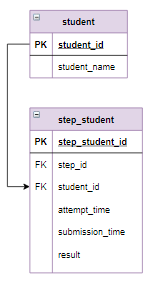

# Задание

**Задание**

Вычислить прогресс пользователей по курсу. Прогресс вычисляется как отношение верно пройденных шагов к общему количеству шагов в процентах, округленное до целого. В нашей базе данные о решениях занесены не для всех шагов, поэтому общее количество шагов определить как количество различных шагов в таблице `step_student`.

Тем пользователям, которые прошли все шаги (прогресс = 100%) выдать "Сертификат с отличием". Тем, у кого прогресс больше или равен 80% - "Сертификат". Для остальных записей в столбце `Результат` задать пустую строку ("").

Информацию отсортировать по убыванию прогресса, затем по имени пользователя в алфавитном порядке.

**Фрагмент логической схемы базы данных:**

<p float="left">

</p>

Введите SQL запрос

*Результат:*

```mysql
Affected rows: 0

Query result:
+------------+----------+-----------------------+
| Студент    | Прогресс | Результат             |
+------------+----------+-----------------------+
| student_60 | 100      | Сертификат с отличием |
| student_15 | 94       | Сертификат            |
| student_18 | 94       | Сертификат            |
| student_27 | 94       | Сертификат            |
| student_30 | 94       | Сертификат            |
| student_31 | 94       | Сертификат            |
| student_36 | 94       | Сертификат            |
| student_39 | 94       | Сертификат            |
| student_4  | 94       | Сертификат            |
| student_43 | 94       | Сертификат            |
| student_44 | 94       | Сертификат            |
| student_46 | 94       | Сертификат            |
| student_49 | 94       | Сертификат            |
| student_51 | 94       | Сертификат            |
| student_53 | 94       | Сертификат            |
| student_59 | 91       | Сертификат            |
| student_9  | 91       | Сертификат            |
| student_23 | 88       | Сертификат            |
| student_50 | 84       | Сертификат            |
| student_20 | 78       |                       |
| student_24 | 78       |                       |
| student_52 | 63       |                       |
| student_56 | 63       |                       |
| student_34 | 59       |                       |
| student_40 | 59       |                       |
| student_11 | 50       |                       |
| student_48 | 50       |                       |
| student_42 | 47       |                       |
| student_61 | 44       |                       |
| student_13 | 41       |                       |
| student_26 | 41       |                       |
| student_1  | 34       |                       |
| student_10 | 34       |                       |
| student_12 | 34       |                       |
| student_14 | 34       |                       |
| student_19 | 34       |                       |
| student_2  | 34       |                       |
| student_21 | 34       |                       |
| student_22 | 34       |                       |
| student_25 | 34       |                       |
| student_28 | 34       |                       |
| student_3  | 34       |                       |
| student_32 | 34       |                       |
| student_35 | 34       |                       |
| student_37 | 34       |                       |
| student_41 | 34       |                       |
| student_45 | 34       |                       |
| student_54 | 34       |                       |
| student_55 | 34       |                       |
| student_57 | 34       |                       |
| student_6  | 34       |                       |
| student_62 | 34       |                       |
| student_7  | 34       |                       |
| student_8  | 34       |                       |
| student_17 | 31       |                       |
| student_33 | 31       |                       |
| student_38 | 31       |                       |
| student_58 | 31       |                       |
| student_64 | 31       |                       |
| student_16 | 28       |                       |
| student_5  | 28       |                       |
| student_63 | 28       |                       |
| student_29 | 25       |                       |
| student_47 | 25       |                       |
+------------+----------+-----------------------+
Affected rows: 64
```

```mysql
SET @max_progress = (SELECT COUNT(DISTINCT step_id) FROM step_student);
WITH get_count_correct (student_id, progress) AS
    (SELECT student_id, ROUND(count(distinct step_id)/@max_progress*100,0) AS progress
     FROM step_student
     WHERE result = "correct"
     GROUP BY student_id)
SELECT DISTINCT student_name AS Студент, progress AS Прогресс,
       CASE
           WHEN progress = 100 THEN "Сертификат с отличием"
           WHEN progress >= 80 THEN "Сертификат"
           ELSE ""
       END AS Результат
FROM step_student
     JOIN student USING(student_id)
     JOIN get_count_correct USING(student_id)
ORDER BY Прогресс DESC, Студент;
```

Вы получили: 2 балл из 2
