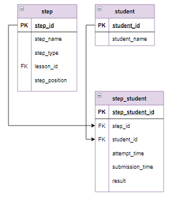

# Оконные функции, оператор OVER, ORDER BY

Оконные функции позволяют получить некоторую дополнительную информацию о выборке данных .  С помощью оконных функций можно реализовать вычисления для набора строк, некоторым образом связанных с текущей строкой. При этом использование оконной функции не группирует несколько строк в одну, а сохраняет все строки запроса. Синтаксис оконных функций:

```mysql
название_функции(выражение) 
  OVER (
        PARTITION BY столбец_1, столбец_2, ... - это окно
        ORDER BY ... - сортировка 
        ROWS BETWEEN - границы окна
          ...
  )
```

Причем все разделы `OVER` являются не обязательными, но обязательно нужно указать либо окно, либо сортировку. На данном шаге рассмотрим самый простой синтаксис оконного выражения:

```mysql
название_функции(выражение) 
  OVER (
        ORDER BY ...
  )
```

Такое оконное выражение позволяет выполнять одинаковые действия над всеми записями таблицы (здесь окно - вся таблица). В качестве функций можно использовать:

`ROW_NUMBER()` - просто нумерация строк;

`RANK()` - ранжирование строк - при одинаковом значении строкам присваивается один номер, с пропуском номеров;

`DENSE_RANK()` - ранжирование строк без пропуска номеров;

`LAG()` - выбирает строку, предшествующую текущей, если таковой нет - выдается `NULL`;

`LEAD()` - выбирает строку, следующую за текущей, если таковой нет - выдается `NULL`.

**Пример**

Вычислить, сколько шагов прошел пользователь. Ранжировать пользователей по убыванию результатов.

**Фрагмент логической схемы базы данных:**

<p float="left">

</p>

*Запрос:*

```mysql
SELECT student_name, count(DISTINCT step_id) AS Kоличество,

    ROW_NUMBER() OVER (ORDER BY  count(DISTINCT step_id) DESC) AS Номер

FROM student INNER JOIN step_student USING (student_id)
WHERE result = "correct"
GROUP BY student_name
```

*Результат:*

```mysql
Query result:
+--------------+------------+-------+
| student_name | Kоличество | Номер |
+--------------+------------+-------+
| student_60   | 32         | 1     |
| student_15   | 30         | 2     |
| student_18   | 30         | 3     |
| student_27   | 30         | 4     |
| student_30   | 30         | 5     |
| student_31   | 30         | 6     |
| student_36   | 30         | 7     |
              ...
| student_5    | 9          | 61    |
| student_63   | 9          | 62    |
| student_29   | 8          | 63    |
| student_47   | 8          | 64    |
+--------------+------------+-------+
Affected rows: 64
```

В этом запросе после того, как были выбраны все студенты, посчитаны их шаги с правильными ответами, с помощью оконной функции была выполнена сортировка по количеству верных шагов (`count(DISTINCT step_id)`)  и пронумерованы строки (функция `ROW_NUMBER()`).

Дополнительно ранжируем студентов.

*Запрос:*

```mysql
SELECT student_name, count(DISTINCT step_id) AS Kоличество,

    ROW_NUMBER() OVER (ORDER BY  count(DISTINCT step_id) DESC) AS Номер,

    RANK() OVER (ORDER BY  count(DISTINCT step_id) DESC) AS Ранг,
    DENSE_RANK() OVER (ORDER BY  count(DISTINCT step_id) DESC) AS Рейтинг

FROM student INNER JOIN step_student USING (student_id)
WHERE result = "correct"
GROUP BY student_name
```

*Результат:*

```mysql
+--------------+------------+-------+------+---------+
| student_name | Kоличество | Номер | Ранг | Рейтинг |
+--------------+------------+-------+------+---------+
| student_60   | 32         | 1     | 1    | 1       |
| student_15   | 30         | 2     | 2    | 2       |
| student_18   | 30         | 3     | 2    | 2       |
| student_27   | 30         | 4     | 2    | 2       |
| student_30   | 30         | 5     | 2    | 2       |
| student_31   | 30         | 6     | 2    | 2       |
| student_36   | 30         | 7     | 2    | 2       |
| student_39   | 30         | 8     | 2    | 2       |
| student_4    | 30         | 9     | 2    | 2       |
| student_43   | 30         | 10    | 2    | 2       |
| student_44   | 30         | 11    | 2    | 2       |
| student_46   | 30         | 12    | 2    | 2       |
| student_49   | 30         | 13    | 2    | 2       |
| student_51   | 30         | 14    | 2    | 2       |
| student_53   | 30         | 15    | 2    | 2       |
| student_59   | 29         | 16    | 16   | 3       |
| student_9    | 29         | 17    | 16   | 3       |
| student_23   | 28         | 18    | 18   | 4       |
| student_50   | 27         | 19    | 19   | 5       |
                        ...
| student_5    | 9          | 61    | 60   | 15      |
| student_63   | 9          | 62    | 60   | 15      |
| student_29   | 8          | 63    | 63   | 16      |
| student_47   | 8          | 64    | 63   | 16      |
+--------------+------------+-------+------+---------+
Affected rows: 64
```

С помощью функции `RANK()` и `DENSE_RANK()` все студенты, имеющие 30  верно пройденных шагов, получили ранг 2 и  рейтинг 2. Студентам с 29 балами присвоен ранг 16 и  рейтинг 3.

**Пример**

Для каждого студента указать, на сколько меньше он прошел шагов, чем идущий перед ним по рейтингу студент.

*Запрос:*

```mysql
SELECT student_name, count(DISTINCT step_id) AS Количество,

       LAG(count(DISTINCT step_id)) 
       OVER (ORDER BY  count(DISTINCT step_id) DESC) - count(DISTINCT step_id) AS Разница

FROM student INNER JOIN step_student USING (student_id)
WHERE result = "correct"
GROUP BY student_name
```

*Результат:*

```mysql
+--------------+------------+---------+
| student_name | Количество | Разница |
+--------------+------------+---------+
| student_60   | 32         | None    |
| student_15   | 30         | 2       |
| student_18   | 30         | 0       |
| student_27   | 30         | 0       |
| student_30   | 30         | 0       |
| student_31   | 30         | 0       |
| student_36   | 30         | 0       |

| student_63   | 9          | 0       |
| student_29   | 8          | 1       |
| student_47   | 8          | 0       |
+--------------+------------+---------+
Affected rows: 64
```

Так как у первой записи нет предыдущей - значение разницы `NULL`. Заменим ее на 0 с помощью функции:

```mysql
IFNULL(выражение, результат)
```

которая возвращает результат, если выражение равно `NULL`, и само выражение в противном случае.

*Запрос:*

```mysql
SELECT student_name, count(DISTINCT step_id) AS Количество,

       IFNULL(LAG(count(DISTINCT step_id)) 
              OVER (ORDER BY  count(DISTINCT step_id) DESC) - count(DISTINCT step_id), 
              0) AS Разница

FROM student INNER JOIN step_student USING (student_id)
WHERE result = "correct"
GROUP BY student_name
```

*Результат:*

```mysql
+--------------+------------+---------+
| student_name | Количество | Разница |
+--------------+------------+---------+
| student_60   | 32         | 0       |
| student_15   | 30         | 2       |
| student_18   | 30         | 0       |
| student_27   | 30         | 0       |
| student_30   | 30         | 0       |
| student_31   | 30         | 0       |
| student_36   | 30         | 0       |
              ...
| student_63   | 9          | 0       |
| student_29   | 8          | 1       |
| student_47   | 8          | 0       |
+--------------+------------+---------+
Affected rows: 64
```

**Задание**

Для студента с именем `student_61` вывести все его попытки: название шага, результат и дату отправки попытки (`submission_time`). Информацию отсортировать по дате отправки попытки и указать, сколько минут прошло между отправкой соседних попыток. Название шага ограничить 20 символами и добавить "...". Столбцы назвать `Студент, Шаг, Результат, Дата_отправки, Разница`.

**Фрагмент логической схемы данных:**

<p float="left">

</p>

Введите SQL запрос

*Результат:*

```mysql
Query result:
+------------+-------------------------+-----------+---------------------+------------------+
| Студент    | Шаг                     | Результат | Дата_отправки       | Разница          |
+------------+-------------------------+-----------+---------------------+------------------+
| student_61 | Выборка всех данных ... | correct   | 2020-08-27 14:22:14 | 0:00:00          |
| student_61 | Выборка отдельных ст... | correct   | 2020-08-27 14:23:53 | 0:01:39          |
| student_61 | Выборка отдельных ст... | correct   | 2020-08-27 14:28:41 | 0:04:48          |
| student_61 | Выборка данных с соз... | wrong     | 2020-08-27 14:33:57 | 0:05:16          |
| student_61 | Выборка данных с соз... | wrong     | 2020-08-27 14:34:24 | 0:00:27          |
| student_61 | Выборка данных с соз... | correct   | 2020-08-27 14:34:50 | 0:00:26          |
| student_61 | Выборка данных, вычи... | correct   | 2020-08-27 14:42:44 | 0:07:54          |
| student_61 | Выборка данных, вычи... | wrong     | 2020-08-27 14:54:06 | 0:11:22          |
| student_61 | Выборка данных, вычи... | wrong     | 2020-08-27 14:55:04 | 0:00:58          |
| student_61 | Выборка данных, вычи... | wrong     | 2020-08-27 14:58:23 | 0:03:19          |
| student_61 | Выборка данных, вычи... | wrong     | 2020-08-27 14:58:56 | 0:00:33          |
| student_61 | Выборка данных, вычи... | wrong     | 2020-08-27 14:59:09 | 0:00:13          |
| student_61 | Выборка данных, вычи... | wrong     | 2020-08-27 14:59:49 | 0:00:40          |
| student_61 | Выборка данных, вычи... | wrong     | 2020-08-27 15:01:00 | 0:01:11          |
| student_61 | Выборка данных, вычи... | wrong     | 2020-08-27 15:05:20 | 0:04:20          |
| student_61 | Выборка данных, вычи... | wrong     | 2020-08-27 15:06:19 | 0:00:59          |
| student_61 | Выборка данных, вычи... | wrong     | 2020-08-27 15:06:58 | 0:00:39          |
| student_61 | Выборка данных, вычи... | wrong     | 2020-08-27 15:08:40 | 0:01:42          |
| student_61 | Выборка данных, вычи... | wrong     | 2020-08-27 15:09:02 | 0:00:22          |
| student_61 | Выборка данных, вычи... | correct   | 2020-08-27 15:13:06 | 0:04:04          |
| student_61 | Выборка данных по ус... | wrong     | 2020-08-27 15:21:02 | 0:07:56          |
| student_61 | Выборка данных по ус... | correct   | 2020-08-27 15:21:18 | 0:00:16          |
| student_61 | Выборка данных, логи... | correct   | 2020-08-27 15:26:05 | 0:04:47          |
| student_61 | Выборка данных, опер... | correct   | 2020-08-27 15:31:31 | 0:05:26          |
| student_61 | Выборка данных, опер... | wrong     | 2020-08-27 15:42:30 | 0:10:59          |
| student_61 | Выборка данных, опер... | wrong     | 2020-08-27 15:43:35 | 0:01:05          |
| student_61 | Выборка данных, опер... | wrong     | 2020-08-27 15:48:09 | 0:04:34          |
| student_61 | Выборка данных, опер... | wrong     | 2020-08-27 15:49:47 | 0:01:38          |
| student_61 | Выборка данных, опер... | wrong     | 2020-08-27 15:52:13 | 0:02:26          |
| student_61 | Выборка данных, опер... | wrong     | 2020-08-27 15:57:41 | 0:05:28          |
| student_61 | Выборка данных, опер... | wrong     | 2020-08-27 15:57:53 | 0:00:12          |
| student_61 | Выборка данных, опер... | wrong     | 2020-08-27 15:58:28 | 0:00:35          |
| student_61 | Выборка данных, опер... | wrong     | 2020-08-27 15:59:58 | 0:01:30          |
| student_61 | Выборка данных, опер... | wrong     | 2020-08-27 16:00:22 | 0:00:24          |
| student_61 | Выборка данных, опер... | correct   | 2020-08-27 16:01:05 | 0:00:43          |
| student_61 | Выборка данных с сор... | wrong     | 2020-08-27 16:12:51 | 0:11:46          |
| student_61 | Выборка данных с сор... | correct   | 2020-08-27 16:14:15 | 0:01:24          |
| student_61 | Соединение INNER JOI... | correct   | 2020-09-01 07:25:39 | 4 days, 15:11:24 |
| student_61 | Внешнее соединение L... | wrong     | 2020-09-01 09:53:30 | 2:27:51          |
| student_61 | Внешнее соединение L... | correct   | 2020-09-01 09:53:50 | 0:00:20          |
| student_61 | Перекрестное соедине... | wrong     | 2020-09-01 10:45:30 | 0:51:40          |
| student_61 | Перекрестное соедине... | wrong     | 2020-09-01 10:46:21 | 0:00:51          |
| student_61 | Перекрестное соедине... | correct   | 2020-09-01 10:47:55 | 0:01:34          |
+------------+-------------------------+-----------+---------------------+------------------+
Affected rows: 43
```

```mysql
SELECT student_name AS Студент,
       CONCAT(LEFT(step_name, 20),'...') AS Шаг,
       result AS Результат,
       FROM_UNIXTIME(submission_time) AS Дата_отправки,
       
       SEC_TO_TIME(submission_time - LAG(submission_time,1,submission_time) 
       OVER (ORDER BY  submission_time)) AS Разница
       
FROM step_student
     JOIN student USING(student_id)
     JOIN step USING(step_id)
WHERE student_name = "student_61"
ORDER BY Дата_отправки;
```

Вы получили: 2 балл из 2
