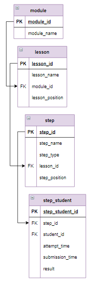

# Задание

**Задание**

Посчитать среднее время, за которое пользователи проходят урок по следующему алгоритму:
- для каждого пользователя вычислить время прохождения **шага** как сумму времени, потраченного на каждую попытку (время попытки - это разница между временем отправки задания и временем начала попытки), при этом попытки, которые длились больше 4 часов не учитывать, так как пользователь мог просто оставить задание открытым в браузере, а вернуться к нему на следующий день;
- для каждого студента посчитать общее время, которое он затратил на каждый **урок**;
- вычислить среднее время выполнения урока в часах, результат округлить до 2-х знаков после запятой;
- вывести информацию по возрастанию времени, пронумеровав строки, для каждого урока указать номер модуля и его позицию в нем.

Столбцы результата назвать `Номер, Урок, Среднее_время`.

**Фрагмент логической схемы базы данных:**

<p float="left">

</p>

Введите SQL запрос

*Результат:*

```mysql
Query result:
+-------+-------------------------------------------------------------+---------------+
| Номер | Урок                                                        | Среднее_время |
+-------+-------------------------------------------------------------+---------------+
| 1     | 2.2 Запросы на выборку, соединение таблиц                   | 2.37          |
| 2     | 1.2 Выборка данных                                          | 2.65          |
| 3     | 2.4 База данных "Интернет-магазин книг", запросы на выборку | 3.65          |
+-------+-------------------------------------------------------------+---------------+
Affected rows: 3
```

```mysql
WITH lesson_time_spent (student_id,Урок, lesson_spent) AS
(SELECT student_id, Урок, SUM(time_spent)/3600 AS lesson_spent
 FROM (SELECT student_id, step_id, SUM(submission_time - attempt_time) AS time_spent,
              CONCAT(module_id, ".", lesson_position, " ", lesson_name) AS Урок
       FROM step_student
            JOIN step USING(step_id)
            JOIN lesson USING(lesson_id)
       WHERE submission_time - attempt_time < 4 * 3600
       GROUP BY student_id, step_id) AS step_time_spent
GROUP BY student_id, Урок)
SELECT ROW_NUMBER() OVER (ORDER BY AVG(lesson_spent)) AS Номер, Урок,
       ROUND(AVG(lesson_spent), 2) AS Среднее_время
FROM lesson_time_spent
GROUP BY Урок;
```

Вы получили: 2 балл из 2
