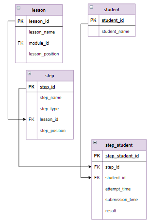

# Оконные функции, оператор OVER, PARTITION BY

Рассмотрим оконную функцию, которая включает два раздела:

```mysql
название_функции(выражение) 
  OVER (
        PARTITION BY ...
        ORDER BY ... 
  )
```

Такое оконное выражение позволяет выполнять одинаковые действия над всеми записями таблицы, ограниченными "окном". Столбцы, образующие окно записываются после `PARTITION BY`. Окном считается совокупность записей, имеющих в столбцах, указанных после `PARTITION BY`, одинаковые значения.

В качестве функций можно использовать те же функции, которые применялись в оконных функциях без указания окна:

`ROW_NUMBER()` - просто нумерация строк внутри окна;

`RANK()` - ранжирование строк внутри окна - при одинаковом значении строкам присваивается один номер, с пропуском номеров;

`DENSE_RANK()` - ранжирование строк внутри окна без пропуска номеров;

`LAG()` - выбирает строку внутри окна, предшествующую текущей, если таковой нет - выдается `NULL`;

`LEAD()` - выбирает строку внутри окна, следующую за текущей, если таковой нет - выдается `NULL`.

**Пример**

Вычислить, сколько шагов прошел пользователь по каждому модулю. Ранжировать пользователей по убыванию результатов в каждом модуле.

**Фрагмент логической схемы базы данных:**

<p float="left">

</p>

*Запрос:*

```mysql
WITH get_rate_lesson(mod_id, stud, rate) 
AS
(
   SELECT module_id, student_name, count(DISTINCT step_id)
   FROM student INNER JOIN step_student USING(student_id)
                INNER JOIN step USING (step_id)
                INNER JOIN lesson USING (lesson_id)
   WHERE result = "correct"
   GROUP BY module_id, student_name
)
SELECT mod_id AS Модуль, stud AS Студент, rate AS Рейтинг,
    ROW_NUMBER() OVER (PARTITION BY mod_id ORDER BY  rate DESC) AS Номер,
    RANK() OVER (PARTITION BY mod_id ORDER BY  rate DESC) AS Ранг,
    DENSE_RANK() OVER (PARTITION BY mod_id ORDER BY  rate DESC) AS Рейтинг  
FROM get_rate_lesson
```

*Результат:*

```mysql
+--------+------------+---------+-------+------+---------+
| Модуль | Студент    | Рейтинг | Номер | Ранг | Рейтинг |
+--------+------------+---------+-------+------+---------+
| 1      | student_1  | 11      | 1     | 1    | 1       |
| 1      | student_10 | 11      | 2     | 1    | 1       |
| 1      | student_11 | 11      | 3     | 1    | 1       |
| 1      | student_12 | 11      | 4     | 1    | 1       |
| 1      | student_13 | 11      | 5     | 1    | 1       |
                        ...
| 1      | student_29 | 8       | 63    | 63   | 4       |
| 1      | student_47 | 8       | 64    | 63   | 4       |
| 2      | student_60 | 21      | 1     | 1    | 1       |
| 2      | student_15 | 19      | 2     | 2    | 2       |
                        ...
| 2      | student_56 | 9       | 23    | 22   | 7       |
| 2      | student_34 | 8       | 24    | 24   | 8       |
| 2      | student_40 | 8       | 25    | 24   | 8       |
| 2      | student_11 | 5       | 26    | 26   | 9       |
| 2      | student_48 | 5       | 27    | 26   | 9       |
| 2      | student_42 | 4       | 28    | 28   | 10      |
| 2      | student_61 | 3       | 29    | 29   | 11      |
| 2      | student_13 | 2       | 30    | 30   | 12      |
| 2      | student_26 | 2       | 31    | 30   | 12      |
+--------+------------+---------+-------+------+---------+
Affected rows: 95
```

Как видно из результирующей таблицы, и нумерация, и ранжирование, и рейтинг осуществляется сначала (с 1) для каждого модуля.

Другой тип функций - это функции, которые используются для вычислений со значениями столбцов, входящих в окно:

```mysql
SUM(), MAX(), MIN(), AVG(), COUNT()
```

По записи они точно соответствуют групповым функциям, при этом вычисленное значение заносится в каждую запись окна. В то время как при использовании группировки возвращается одна запись для каждой группы.

Как правило, эти функции используются в следующем контексте:

```mysql
название_функции(выражение) 
  OVER (
        PARTITION BY ...
  )
```

**Пример**

Посчитать, сколько шагов пройдено пользователями по каждому уроку. Вывести максимальное и минимальное значение пройденных шагов по каждому модулю.

*Запрос:*

```mysql
WITH get_rate_lesson(mod_id, les, rate) 
AS
(
   SELECT module_id,CONCAT(module_id,'.', lesson_position),count(DISTINCT step_id)
   FROM step_student INNER JOIN step USING (step_id)
                     INNER JOIN lesson USING (lesson_id)
   WHERE result = "correct"
   GROUP BY module_id, 2
)
SELECT mod_id AS Модуль, les AS Урок, rate AS Пройдено_шагов, 
    MAX(rate) OVER (PARTITION BY mod_id) AS Максимум_по_модулю,
    MIN(rate) OVER (PARTITION BY mod_id) AS Минимум_по_модулю
FROM get_rate_lesson
```

*Результат:*

```mysql
+--------+------+----------------+--------------------+-------------------+
| Модуль | Урок | Пройдено_шагов | Максимум_по_модулю | Минимум_по_модулю |
+--------+------+----------------+--------------------+-------------------+
| 1      | 1.2  | 11             | 11                 | 11                |
| 2      | 2.2  | 8              | 13                 | 8                 |
| 2      | 2.4  | 13             | 13                 | 8                 |
+--------+------+----------------+--------------------+-------------------+
Affected rows: 3
```

**Задание**

Вычислить рейтинг каждого студента относительно студента, прошедшего наибольшее количество шагов в модуле (вычисляется как отношение количества пройденных студентом шагов к максимальному количеству пройденных шагов, умноженное на 100). Вывести номер модуля, имя студента, количество пройденных им шагов и относительный рейтинг. Относительный рейтинг округлить до одного знака после запятой. Столбцы назвать `Модуль`, `Студент`, `Пройдено_шагов` и `Относительный_рейтинг` соответственно. Информацию отсортировать сначала по возрастанию номера модуля, потом по убыванию относительного рейтинга и, наконец, по имени студента в алфавитном порядке.

Введите SQL запрос

*Результат:*

```mysql
Query result:
+--------+------------+----------------+-----------------------+
| Модуль | Студент    | Пройдено_шагов | Относительный_рейтинг |
+--------+------------+----------------+-----------------------+
| 1      | student_1  | 11             | 100.0                 |
| 1      | student_10 | 11             | 100.0                 |
| 1      | student_11 | 11             | 100.0                 |
| 1      | student_12 | 11             | 100.0                 |
| 1      | student_13 | 11             | 100.0                 |
| 1      | student_14 | 11             | 100.0                 |
| 1      | student_15 | 11             | 100.0                 |
| 1      | student_18 | 11             | 100.0                 |
| 1      | student_19 | 11             | 100.0                 |
| 1      | student_2  | 11             | 100.0                 |
| 1      | student_20 | 11             | 100.0                 |
| 1      | student_21 | 11             | 100.0                 |
| 1      | student_22 | 11             | 100.0                 |
| 1      | student_23 | 11             | 100.0                 |
| 1      | student_24 | 11             | 100.0                 |
| 1      | student_25 | 11             | 100.0                 |
| 1      | student_26 | 11             | 100.0                 |
| 1      | student_27 | 11             | 100.0                 |
| 1      | student_28 | 11             | 100.0                 |
| 1      | student_3  | 11             | 100.0                 |
| 1      | student_30 | 11             | 100.0                 |
| 1      | student_31 | 11             | 100.0                 |
| 1      | student_32 | 11             | 100.0                 |
| 1      | student_34 | 11             | 100.0                 |
| 1      | student_35 | 11             | 100.0                 |
| 1      | student_36 | 11             | 100.0                 |
| 1      | student_37 | 11             | 100.0                 |
| 1      | student_39 | 11             | 100.0                 |
| 1      | student_4  | 11             | 100.0                 |
| 1      | student_40 | 11             | 100.0                 |
| 1      | student_41 | 11             | 100.0                 |
| 1      | student_42 | 11             | 100.0                 |
| 1      | student_43 | 11             | 100.0                 |
| 1      | student_44 | 11             | 100.0                 |
| 1      | student_45 | 11             | 100.0                 |
| 1      | student_46 | 11             | 100.0                 |
| 1      | student_48 | 11             | 100.0                 |
| 1      | student_49 | 11             | 100.0                 |
| 1      | student_50 | 11             | 100.0                 |
| 1      | student_51 | 11             | 100.0                 |
| 1      | student_52 | 11             | 100.0                 |
| 1      | student_53 | 11             | 100.0                 |
| 1      | student_54 | 11             | 100.0                 |
| 1      | student_55 | 11             | 100.0                 |
| 1      | student_56 | 11             | 100.0                 |
| 1      | student_57 | 11             | 100.0                 |
| 1      | student_59 | 11             | 100.0                 |
| 1      | student_6  | 11             | 100.0                 |
| 1      | student_60 | 11             | 100.0                 |
| 1      | student_61 | 11             | 100.0                 |
| 1      | student_62 | 11             | 100.0                 |
| 1      | student_7  | 11             | 100.0                 |
| 1      | student_8  | 11             | 100.0                 |
| 1      | student_9  | 11             | 100.0                 |
| 1      | student_17 | 10             | 90.9                  |
| 1      | student_33 | 10             | 90.9                  |
| 1      | student_38 | 10             | 90.9                  |
| 1      | student_58 | 10             | 90.9                  |
| 1      | student_64 | 10             | 90.9                  |
| 1      | student_16 | 9              | 81.8                  |
| 1      | student_5  | 9              | 81.8                  |
| 1      | student_63 | 9              | 81.8                  |
| 1      | student_29 | 8              | 72.7                  |
| 1      | student_47 | 8              | 72.7                  |
| 2      | student_60 | 21             | 100.0                 |
| 2      | student_15 | 19             | 90.5                  |
| 2      | student_18 | 19             | 90.5                  |
| 2      | student_27 | 19             | 90.5                  |
| 2      | student_30 | 19             | 90.5                  |
| 2      | student_31 | 19             | 90.5                  |
| 2      | student_36 | 19             | 90.5                  |
| 2      | student_39 | 19             | 90.5                  |
| 2      | student_4  | 19             | 90.5                  |
| 2      | student_43 | 19             | 90.5                  |
| 2      | student_44 | 19             | 90.5                  |
| 2      | student_46 | 19             | 90.5                  |
| 2      | student_49 | 19             | 90.5                  |
| 2      | student_51 | 19             | 90.5                  |
| 2      | student_53 | 19             | 90.5                  |
| 2      | student_59 | 18             | 85.7                  |
| 2      | student_9  | 18             | 85.7                  |
| 2      | student_23 | 17             | 81.0                  |
| 2      | student_50 | 16             | 76.2                  |
| 2      | student_20 | 14             | 66.7                  |
| 2      | student_24 | 14             | 66.7                  |
| 2      | student_52 | 9              | 42.9                  |
| 2      | student_56 | 9              | 42.9                  |
| 2      | student_34 | 8              | 38.1                  |
| 2      | student_40 | 8              | 38.1                  |
| 2      | student_11 | 5              | 23.8                  |
| 2      | student_48 | 5              | 23.8                  |
| 2      | student_42 | 4              | 19.0                  |
| 2      | student_61 | 3              | 14.3                  |
| 2      | student_13 | 2              | 9.5                   |
| 2      | student_26 | 2              | 9.5                   |
+--------+------------+----------------+-----------------------+
Affected rows: 95
```

```mysql
WITH get_step_correct(mod_id, stud, step_corr) AS
(SELECT module_id, student_name, count(DISTINCT step_id) AS step_correct
 FROM student
      INNER JOIN step_student USING(student_id)
      INNER JOIN step USING (step_id)
      INNER JOIN lesson USING (lesson_id)
 WHERE result = "correct"
 GROUP BY module_id, student_name)
SELECT mod_id AS Модуль, stud AS Студент, step_corr AS Пройдено_шагов,
       ROUND(100*step_corr/(MAX(step_corr) OVER (PARTITION BY mod_id)), 1) AS Относительный_рейтинг
FROM get_step_correct
ORDER BY Модуль, Относительный_рейтинг DESC, Студент;
```

Вы получили: 2 балл из 2
