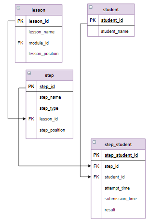

# Задание

**Задание**

Проанализировать, в каком порядке и с каким интервалом пользователь отправлял последнее верно выполненное задание каждого урока. В базе занесены попытки студентов  для трех уроков курса, поэтому анализ проводить только для этих уроков.

Для студентов прошедших как минимум по одному шагу в каждом уроке, найти последний пройденный шаг каждого урока - крайний шаг, и указать:
- имя студента;
- номер урока, состоящий из номера модуля и через точку позиции каждого урока в модуле;
- время отправки  - время подачи решения на проверку;
- разницу во времени отправки между текущим и предыдущим крайним шагом в днях, при этом для первого шага поставить прочерк ("-"), а количество дней округлить до целого в большую сторону.

Столбцы назвать `Студент`, `Урок`, `Макс_время_отправки` и `Интервал` соответственно. Отсортировать результаты по имени студента в алфавитном порядке, а потом по возрастанию времени отправки.

**Фрагмент логической схемы базы данных:**

<p float="left">

</p>

Введите SQL запрос

*Результат:*

```mysql
Affected rows: 0

Query result:
+------------+------+---------------------+----------+
| Студент    | Урок | Макс_время_отправки | Интервал |
+------------+------+---------------------+----------+
| student_15 | 1.2  | 2020-05-20 12:35:57 | -        |
| student_15 | 2.4  | 2020-06-08 07:10:24 | 19       |
| student_15 | 2.2  | 2020-08-18 12:47:03 | 72       |
| student_18 | 1.2  | 2020-04-17 03:22:14 | -        |
| student_18 | 2.2  | 2020-06-18 07:25:44 | 63       |
| student_18 | 2.4  | 2020-06-18 07:34:14 | 1        |
| student_20 | 1.2  | 2020-05-28 12:08:53 | -        |
| student_20 | 2.2  | 2020-06-17 15:55:29 | 21       |
| student_20 | 2.4  | 2020-06-18 09:48:39 | 1        |
| student_23 | 1.2  | 2020-05-24 18:15:27 | -        |
| student_23 | 2.2  | 2020-06-01 04:37:16 | 8        |
| student_23 | 2.4  | 2020-06-01 04:42:36 | 1        |
| student_24 | 1.2  | 2020-04-14 16:16:22 | -        |
| student_24 | 2.2  | 2020-05-11 12:28:49 | 27       |
| student_24 | 2.4  | 2020-05-13 12:20:39 | 2        |
| student_27 | 1.2  | 2020-08-12 10:18:47 | -        |
| student_27 | 2.2  | 2020-08-14 17:14:51 | 3        |
| student_27 | 2.4  | 2020-08-20 12:23:34 | 6        |
| student_30 | 1.2  | 2020-08-10 08:38:49 | -        |
| student_30 | 2.2  | 2020-08-16 12:53:39 | 7        |
| student_30 | 2.4  | 2020-08-19 11:41:49 | 3        |
| student_31 | 1.2  | 2020-06-13 09:03:39 | -        |
| student_31 | 2.2  | 2020-07-02 16:43:36 | 20       |
| student_31 | 2.4  | 2020-07-05 17:18:56 | 4        |
| student_36 | 1.2  | 2020-08-04 07:25:30 | -        |
| student_36 | 2.2  | 2020-08-07 11:39:12 | 4        |
| student_36 | 2.4  | 2020-08-07 20:33:02 | 1        |
| student_39 | 1.2  | 2020-05-31 12:35:10 | -        |
| student_39 | 2.2  | 2020-06-02 09:47:15 | 2        |
| student_39 | 2.4  | 2020-06-02 17:06:41 | 1        |
| student_4  | 1.2  | 2020-05-31 17:46:27 | -        |
| student_4  | 2.2  | 2020-07-27 17:12:45 | 57       |
| student_4  | 2.4  | 2020-07-29 09:21:24 | 2        |
| student_43 | 1.2  | 2020-07-16 21:19:13 | -        |
| student_43 | 2.4  | 2020-08-06 13:02:44 | 21       |
| student_43 | 2.2  | 2020-08-08 20:11:52 | 3        |
| student_44 | 1.2  | 2020-05-26 14:23:39 | -        |
| student_44 | 2.2  | 2020-06-02 11:07:52 | 7        |
| student_44 | 2.4  | 2020-06-06 21:57:20 | 5        |
| student_46 | 1.2  | 2020-05-26 13:02:10 | -        |
| student_46 | 2.4  | 2020-06-03 20:30:01 | 9        |
| student_46 | 2.2  | 2020-06-03 20:54:34 | 1        |
| student_49 | 1.2  | 2020-07-11 16:31:12 | -        |
| student_49 | 2.2  | 2020-07-15 05:00:03 | 4        |
| student_49 | 2.4  | 2020-07-16 04:57:51 | 1        |
| student_50 | 1.2  | 2020-07-01 08:16:41 | -        |
| student_50 | 2.2  | 2020-08-10 08:26:49 | 41       |
| student_50 | 2.4  | 2020-09-09 12:44:00 | 31       |
| student_51 | 1.2  | 2020-09-03 07:24:26 | -        |
| student_51 | 2.2  | 2020-09-07 19:31:01 | 5        |
| student_51 | 2.4  | 2020-09-10 13:12:11 | 3        |
| student_52 | 1.2  | 2020-08-24 18:30:55 | -        |
| student_52 | 2.2  | 2020-09-07 13:51:02 | 14       |
| student_52 | 2.4  | 2020-09-07 22:16:19 | 1        |
| student_53 | 1.2  | 2020-07-11 09:32:33 | -        |
| student_53 | 2.2  | 2020-07-17 12:34:54 | 7        |
| student_53 | 2.4  | 2020-07-19 05:09:32 | 2        |
| student_56 | 1.2  | 2020-07-15 12:20:48 | -        |
| student_56 | 2.2  | 2020-08-06 10:22:13 | 22       |
| student_56 | 2.4  | 2020-08-20 09:18:46 | 14       |
| student_59 | 1.2  | 2020-08-17 19:29:09 | -        |
| student_59 | 2.2  | 2020-08-21 10:35:18 | 4        |
| student_59 | 2.4  | 2020-08-22 10:39:29 | 2        |
| student_60 | 1.2  | 2020-09-01 12:54:58 | -        |
| student_60 | 2.2  | 2020-09-02 15:34:45 | 2        |
| student_60 | 2.4  | 2020-09-03 10:53:13 | 1        |
| student_9  | 1.2  | 2020-05-01 05:40:11 | -        |
| student_9  | 2.2  | 2020-05-05 09:29:20 | 5        |
| student_9  | 2.4  | 2020-05-06 10:52:38 | 2        |
+------------+------+---------------------+----------+
Affected rows: 69
```

```mysql
SET @seconds_in_day = 86400;
WITH max_time AS
(SELECT student_name, CONCAT(module_id,".",lesson_position) AS Урок, MAX(submission_time) AS mt
FROM step_student
     JOIN student USING(student_id)
     JOIN step USING(step_id)
     JOIN lesson USING(lesson_id)
WHERE result = "correct"
GROUP BY student_id, lesson_id),
requirements AS
(SELECT student_name
 FROM max_time
 GROUP BY student_name
 HAVING COUNT(*) = 3)
SELECT student_name AS Студент, Урок,
       FROM_UNIXTIME(mt) AS Макс_время_отправки,
       IFNULL(CEIL((mt - LAG(mt) OVER(PARTITION BY student_name ORDER BY mt)) / @seconds_in_day), '-') AS Интервал
FROM max_time JOIN requirements USING(student_name)
ORDER BY Студент, Макс_время_отправки
```

Вы получили: 2 балл из 2
