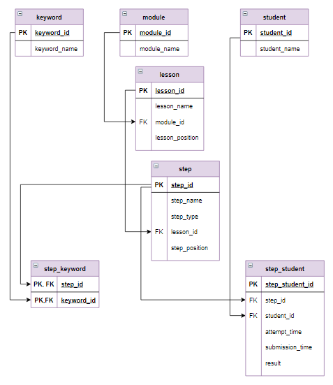

# База данных "Учебная аналитика по курсу"

Уважаемые слушатели, в этом уроке кратко рассматриваются возможности SQL, которых раньше не было. Здесь собраны достаточно сложные задания. А теория приведена в схематическом виде. Изучить новый материал в этом уроке ТРУДНО. Этот урок включен по пожеланиям продвинутых пользователей, которые хотели порешать сложные задания. **Выполнение данного урока - необязательно**.

Если Вы хотите продолжить обучение, узнать больше про SQL, мы предлагаем Вам новый курс, который доступен только в рамках [программы повышения квалификации ДВФУ](http://sql-dvfu.tilda.ws/#rec572038390).

**Курс "Расширенные возможности SQL"  включает 170 новых заданий на реализацию SQL запросов. В этом курсе для выполнения заданий реализованы новые базы данных:**
- Склад;
- Резюме для трудоустройства;
- Библиотека;
- Гостиница.

Подробно рассматриваются следующие возможности:
- функции работы с текстом и датой;
- функция GROUP_CONCAT;
- регулярные выражения;
- оператор CASE;
- табличные выражения в запросах на выборку и в запросах на корректировку;
- оконные функции (три урока);
- триггеры (два урока)
- другое.

**Предметная область**

Курс на платформе Stepik состоит из нескольких модулей, каждый модуль включает несколько уроков, для каждого урока хранится информация о его положении в модуле. Каждый урок состоит из последовательности шагов. Каждый шаг имеет свой тип (это может быть текст, задание на SQL и пр.) и также порядковый номер в уроке.

Пользователи регистрируются на курсе, указывают свое имя. Когда пользователь проходит курс на платформе Stepik, все его действия оставляют "цифровой след": какие задания и когда он выполнил, сколько попыток сделал, правильно ли решил задание. Также хранятся все его комментарии. Если пользователь проходит курс и получает сертификат, то сохраняется дата его выдачи. Вся эта информация является первичной для **учебной аналитики**.

**Учебная аналитика** – это измерение, сбор, анализ и представление данных об обучающихся и их действиях на online платформе с целью понимания и оптимизации учебного процесса и той среды, где этот процесс происходит.

Для данного урока была создана база данных с полным описанием структуры курса. Учебная аналитика же включена в базу не в полном объеме, а только для некоторой группы пользователей из-за большого объема данных. Так, например, информация о решениях 17000 пользователей по нашему курсу за полгода его существования содержит 534500 записей. 

Пользователей для базы данных урока мы отобрали так:
- отбросили всех, кто не выполнил ни одного задания (их оказалось 8800);
- сгруппировали оставшихся пользователей в зависимости от количества решенных заданий, вот что получилось (считаем, что те, кто не отсылал задания больше месяца, покинули курс):

|                         | **Всего** | **Закончили обучение или покинули курс** | **Активные пользователи** |
|:------------------------|:----------|:-----------------------------------------|:--------------------------|
| Выполнили все задания   | 116       | 75                                       | 41                        |
| Получили сертификат     | 617       | 470                                      | 147                       |
| Третий модуль           | 225       | 220                                      | 5                         |
| Второй модуль           | 940       | 762                                      | 178                       |
| Первый модуль, 5-7 урок | 1077      | 891                                      | 186                       |
| Первый модуль, 4 урок   | 701       | 589                                      | 112                       |
| Первый модуль, 3 урок   | 823       | 670                                      | 153                       |
| Первый модуль, 2 урок   | 1268      | 1044                                     | 224                       |
| Первый модуль, 1 урок   | 2430      | 2020                                     | 410                       |

- затем отобрали типичных представителей групп более или менее пропорционально численности каждой группы (имена пользователей, конечно, заменили);
- поскольку пользователи отправляли от 1 до 1000 решений за время прохождения курса, в базу включили только попытки  шагов, относящихся к урокам 1.2, 2.2 и 2.4.

Получилось 64 пользователя и более 2000 их попыток.

*Группировка и выборка каждой группы обычно зависит от целей  исследования, например, если нужно понять когда и по какой причине пользователи покидают курс - то для начальных шагов нужно более "мелкое" деление*

Запросы по предметной области:
- навигатор по шагам курса;
- заполнение таблицы для навигации по ключевым словам;
- поиск по ключевым словам;
- выборка данных по нескольким условиям, оператор CASE;
- табличные выражения, оператор WITH;
- задание, вычисление прогресса пользователей;
- оконные функции, оператор OVER, ORDER BY;
- задание, среднее время выполнения урока;
- оконные функции, оператор OVER, PARTITION BY;
- задание, периодичность работы обучающегося с курсом;
- задание, статистика по всем попыткам обучающегося.

**Логическая схема базы данных**

<p float="left">

</p>

**Структура и наполнение таблиц**

Таблица `module`:

| **module_id**                    | **module_name**                  |
|:---------------------------------|:---------------------------------|
| `INT PRIMARY KEY AUTO_INCREMENT` | `VARCHAR(64)`                    |
| 1                                | Основы реляционной модели и SQL  |
| 2                                | Запросы SQL к связанным таблицам |

Таблица `lesson` (в последнем столбце указан порядковый номер урока внутри модуля):

| **lesson_id**                    | **lesson_name**                            | **module_id** | **lesson_position** |
|:---------------------------------|:-------------------------------------------|:--------------|:--------------------|
| `INT PRIMARY KEY AUTO_INCREMENT` | `VARCHAR(50)`                              | `INT`         | `INT`               |
| 1                                | Отношение(таблица)                         | 1             | 1                   |
| 2                                | Выборка данных                             | 1             | 2                   |
| 3                                | Таблица "Командировки", запросы на выборку | 1             | 6                   |
| 4                                | Вложенные запросы                          | 1             | 4                   |

Таблица `step`:

| **step_id**                      | **step_name**                          | **step_type** | **lesson_id** | **step_position** |
|:---------------------------------|:---------------------------------------|:--------------|:--------------|:------------------|
| `INT PRIMARY KEY AUTO_INCREMENT` | `VARCHAR(256)`                         | `VARCHAR(16)` | `INT`         | `INT`             |
| 1                                | Структура уроков курса                 | text          | 1             | 1                 |
| 2                                | Содержание урока                       | text          | 1             | 2                 |
| 3                                | Реляционная модель, основные положения | table         | 1             | 3                 |
| 4                                | Отношение, реляционная модель          | choice        | 1             | 4                 |

Таблица `keyword`:

| **keyword_id**                   | **keyword_name** |
|:---------------------------------|:-----------------|
| `INT PRIMARY KEY AUTO_INCREMENT` | `VARCHAR(16)`    |
| 1                                | SELECT           |
| 2                                | FROM             |

Таблица `step_keyword`:

| **step_id**       | **keyword_id**    |
|:------------------|:------------------|
| `INT PRIMARY KEY` | `INT PRIMARY KEY` |
| 38                | 1                 |
| 81                | 3                 |

**Пояснение**

В этой таблице ключ состоит из двух столбцов. Это сделано для того, чтобы в таблицу нельзя было включить одинаковые записи. Для создания таблицы с двумя ключами используется код:

```mysql
CREATE TABLE step_keyword (
    step_id INT,
    keyword_id INT,
    PRIMARY KEY (step_id, keyword_id),
    FOREIGN KEY (step_id)  REFERENCES step (step_id) ON DELETE CASCADE,
    FOREIGN KEY (keyword_id)  REFERENCES keyword (keyword_id) ON DELETE CASCADE
);
```

Таблица `student`:

| **student_id**                   | **student_name** |
|:---------------------------------|:-----------------|
| `INT PRIMARY KEY AUTO_INCREMENT` | `VARCHAR(64)`    |
| 1                                | student_1        |
| 2                                | student_2        |

Таблица `step_student` (в этой таблице хранятся все попытки пользователей по каждому шагу, указывается время начала попытки и время отправки задания на проверку, а также верный или неверный получился результат):

| **student_id**                   | **student_name** | **student_name** | **student_name** | **student_name** | **student_name** |
|:---------------------------------|:-----------------|:-----------------|:-----------------|:-----------------|:-----------------|
| `INT PRIMARY KEY AUTO_INCREMENT` | `INT`            | `INT`            | `INT`            | `INT`            | `VARCHAR(16)`    |
| 1                                | 10               | 52               | 1598291444       | 1598291490       | correct          |
| 2                                | 10               | 11               | 1593291995       | 1593292031       | correct          |
| 3                                | 10               | 19               | 1591017571       | 1591017743       | wrong            |
| 4                                | 10               | 4                | 1590254781       | 1590254800       | correct          |
